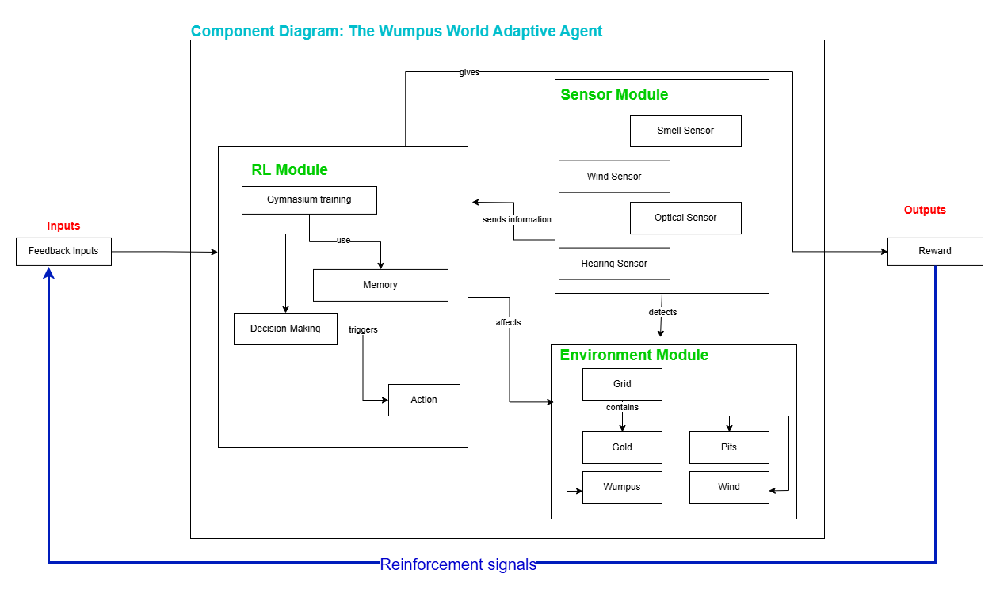

# Workshop 1: System design
## Component diagram

The diagram shows how the different modules interact with each other for iteration, so that the RL module, the framework and the action tiggered modify the agent environment like the position of gold, wind and smell in the discovered world for now. This is detected by the agent's sensors and sent to the RL module to give the new output and initiate the feedback loop (next diagram).
## Feedback Loops Illustration

In a complete overview of how feedback comes into action in the adventurer in Wumpus AI World, the most important thing in each iteration is the reward, this is analyzed, evaluated (in the first instance if it is >50 or not) and based on this, the learning has punishment or not for the next iteration.
